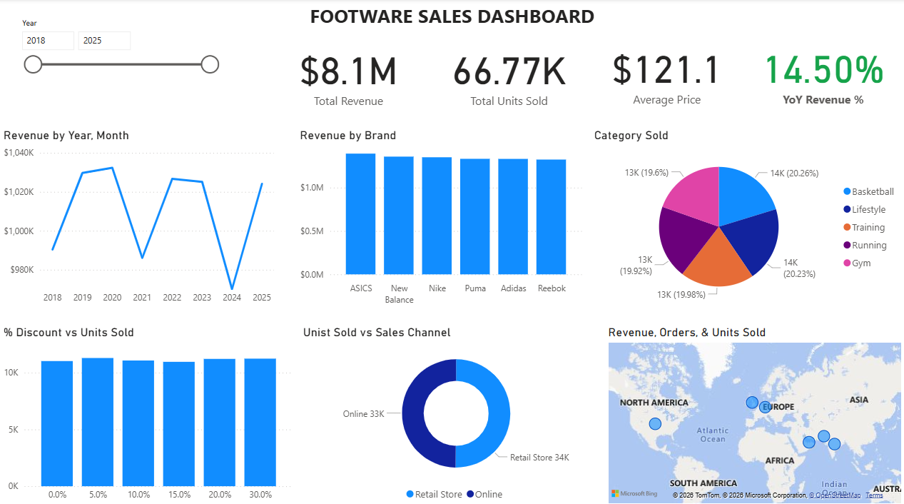

# 💰 Sport Footwear Sales Performance Analysis

---

## 📌 Overview

This project analyzes sport footwear sales performance from 2018 to 2025 using SQL, Python, and Power BI.
The goal is to identify key trends, evaluate business performance, and provide data-driven insights to support decision-making.  

## 📈 Dashboard Preview

The dashboard provides a comprehensive view of key business metrics, including:
- Total Revenue  
- Units Sold  
- Average Price  
- Year-over-Year (YoY) Growth  

It is designed to help stakeholders:
- Understand sales performance 
- Identify key revenue drivers  
- Support data-driven decision-making  

---

## ✏️ Business Problems

The company is experiencing **inconsistent sales performance**, with limited visibility into the factors driving or hindering revenue growth.
To address this challenge, several key questions need to be explored:

- Which brands contribute the most to overall performance?
- Are discounts truly effective in increasing sales volume?
- Which sales channels and markets offer the greatest growth potential and should be prioritized?

Without clear and actionable insights, the company risks making suboptimal decisions, making it difficult to refine its strategy and achieve sustainable long-term growth.

---
## 🎯 Objective

This project aims to:

- Analyze sales trends over time (2018–2025)
- Identify top-performing brands and product categories
- Evaluate the impact of discounts on revenue
- Compare performance across different markets
- Generate key metrics (e.g., revenue, growth, YoY) to support business decisions

---
## 📂 Data Overview

- **Source**: Sports Footwear Sales & Consumer Behavior (Kaggle)  
- **Period**: 2018 – 2025  
- **Scope**:
  - 26K+ orders  
  - 6 brands  
  - 5 product categories  
  - 6 countries  

### Key Columns
- `order_id`  
- `order_date`  
- `brand`  
- `category`  
- `final_price_usd`  
- `units_sold`  
- `revenue_usd`  
- `discount_percent`  
- `sales_channel`  
- `country`  

---

## 🛠 Tools & Technologies

* SQL – Data cleaning, transformation, and KPI calculation
* Python (Pandas) – Data processing and validation
* Power BI – Data visualization and dashboard creation

---

## 🔄 Project Workflow

- Data Collection: Import raw sport footwear sales dataset (2018–2025).
  
- Data Cleaning & Transformation (SQL): Clean and transform the dataset by handling missing values, correcting data types, and preparing structured tables for analysis.

- Data Analysis & KPI Calculation (SQL): Perform aggregations and calculations such as total revenue, yearly trends, and year-over-year (YoY) growth.

- Data Validation (Python): Reprocess and validate key calculations using Python (Pandas) to ensure consistency and accuracy of results.

- Data Visualization (Power BI): Build an interactive dashboard to present key metrics, trends, and performance insights.

- Insights & Recommendations: Interpret findings to support data-driven business decisions.

---

## 📊 Key Features

* **Key Performance Indicators (KPIs)**
  Track core business metrics, including Total Revenue, Units Sold, Average Price, and Year-over-Year (YoY) Growth to monitor overall performance.

* **Sales Trend Analysis**
  Analyze revenue trends over time to identify growth patterns, fluctuations, and potential seasonality.

* **Brand & Category Performance**
  Evaluate and compare performance across brands and product categories to identify top contributors to revenue.

* **Discount Impact Analysis**
  Assess how discount levels influence sales performance and determine the effectiveness of discount strategies.

* **Sales Channel Analysis**
  Compare online and retail performance to identify high-performing and high-growth channels.

* **Geographic Performance Analysis**
  Examine revenue distribution across countries to highlight key markets and potential expansion opportunities.

---

## 🔍 Key Insights

### 📉 Fluctuating Revenue Trend
Revenue shows noticeable fluctuations, indicating:
- Revenue shows a fluctuating trend over time, with noticeable declines in certain years followed by periods of recovery. 

---

### ⚖️ Proportional Brand Contribution
- ASISCS emerges as the top revenue contributor; however, its lead over other brands remains marginal.
- Similarly, the basketball shoe category records the highest sales volume, but the gap is not particularly significant.

---

### 💸 Limited Impact of Discounts
- Sales volume remains relatively stable across different discount levels, indicating that higher discounts do not significantly drive an increase in units sold.

---

### 🔄 Balanced Sales Channels
- Online and retail are evenly distributed  
- Opportunity to optimize digital channels  

---

### 🌍 Global Market Presence
- Sales across countries look quite similar, with no country standing out significantly

---

## 🚀 Business Recommendations
- Strengthen digital marketing strategies by prioritizing online channels, leveraging trending content, and expanding live shopping activities across social media platforms, as these are likely more effective in driving sales than increasing discount levels.
- Focus on optimizing high-performing brands and product categories, as they have a greater influence on sales performance compared to discount strategies.
- Maintain a balanced market approach by continuing to target multiple countries, while exploring small, localized adjustments to improve performance in each market.

---

## 🧠 Conclusion

Overall, the company’s sales performance remains inconsistent over time. The analysis suggests that brand and product category play a more significant role in driving sales than discount levels, which have limited impact. Additionally, sales are relatively evenly distributed across countries, indicating no dominant market. Therefore, focusing on product strategy and digital marketing efforts may be more effective for improving performance than relying heavily on discounts.
